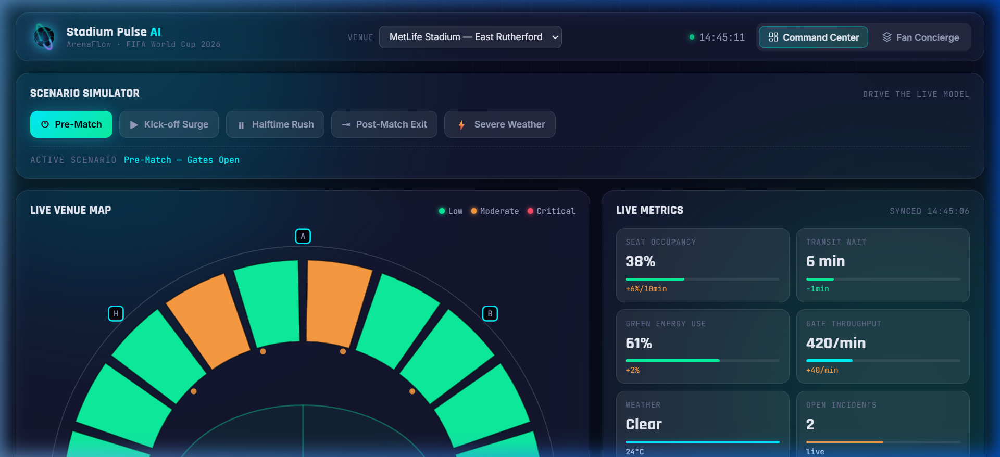
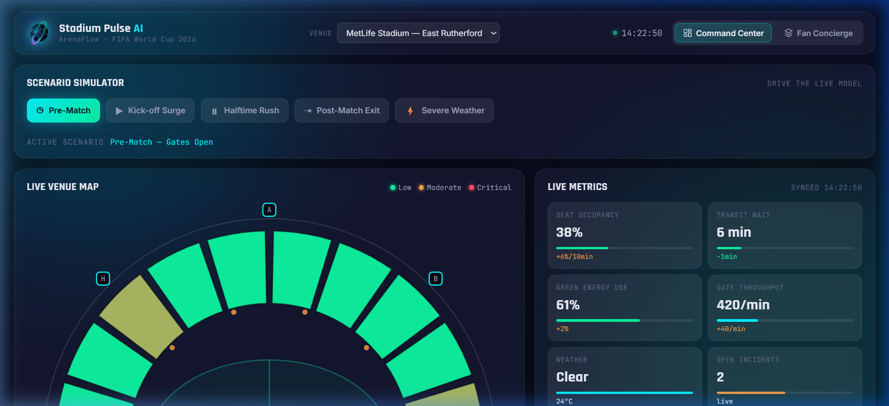
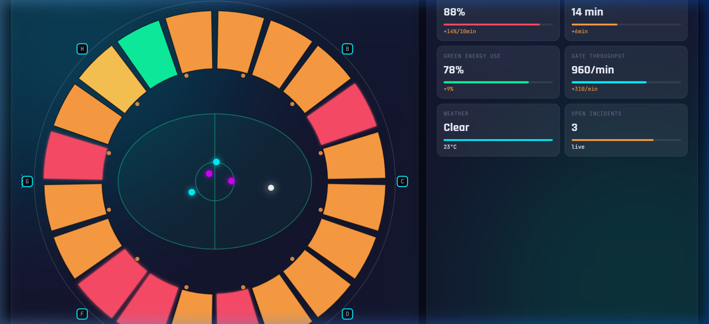
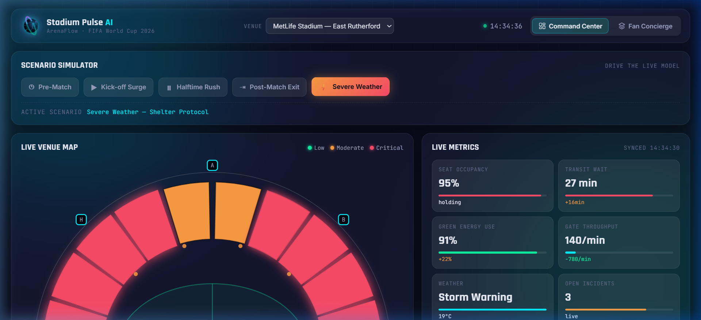
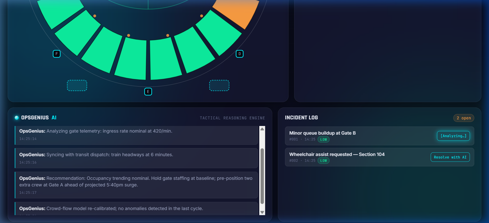
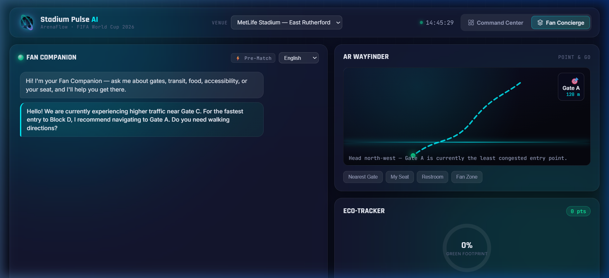
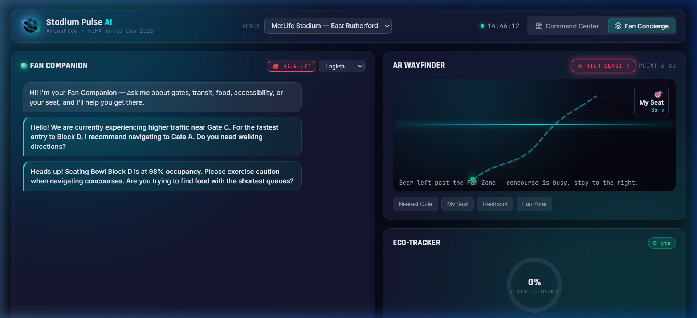
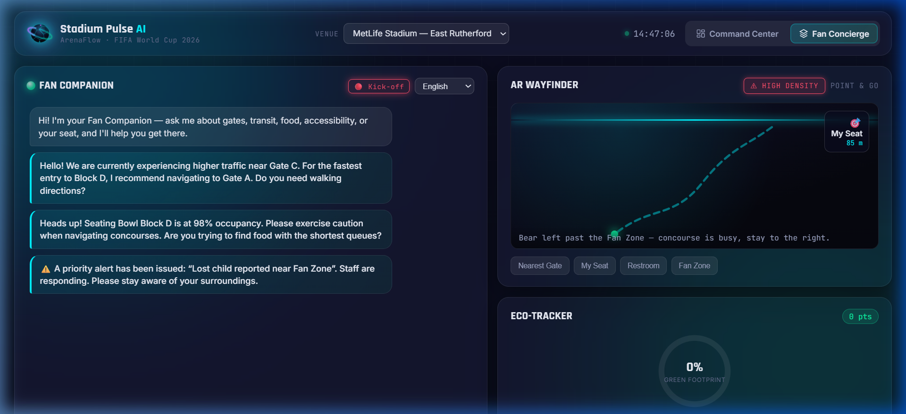
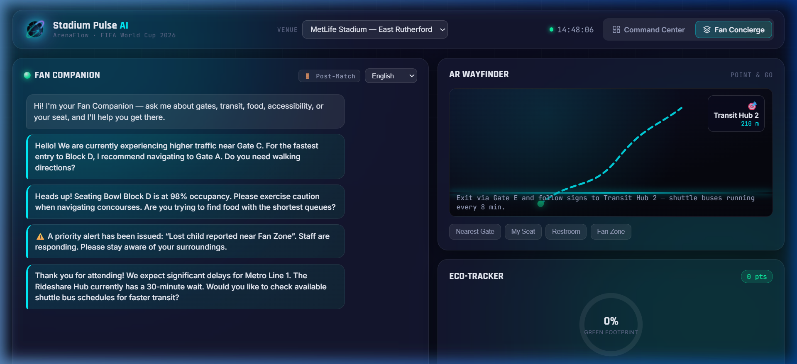
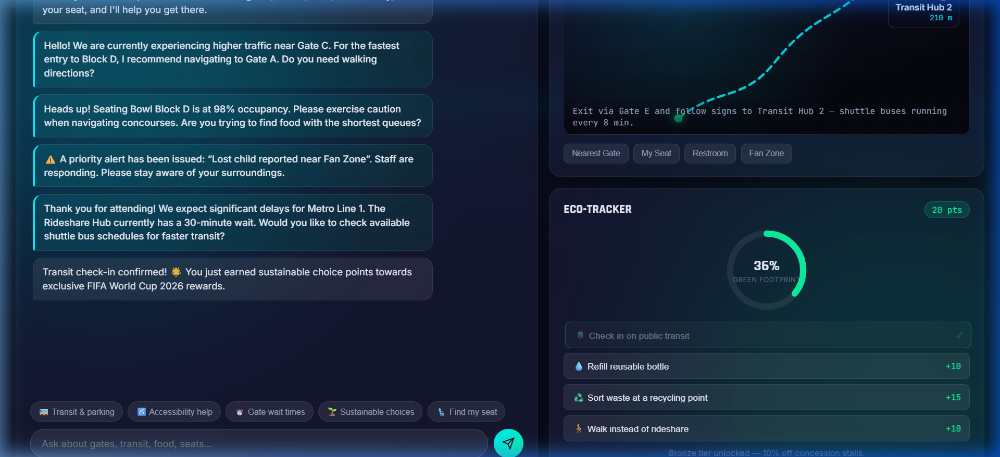

# 🏟️ Stadium Pulse AI — FIFA World Cup 2026 Operations Platform

> **Hackathon Submission** · ArenaFlow · FIFA World Cup 2026 · Built with zero backend, fully offline, client-side simulation

[](LICENSE)


---

## 🎯 What is Stadium Pulse AI?

**Stadium Pulse AI** is a real-time, AI-powered stadium operations and fan engagement dashboard built for the FIFA World Cup 2026. It simulates a live command-and-control center that lets venue operators monitor crowd density, manage incidents, and deploy GenAI-driven tactical recommendations — while simultaneously powering a **Fan Concierge** that gives supporters personalized, contextual guidance through the stadium experience.

**The core insight:** Both the operations team and the fan in the stands need the same information — just presented differently. This app bridges that gap with a **state-driven architecture** that shares a single scenario engine across both views.

---

## ✨ Key Features

### 🖥️ Command Center (Ops Dashboard)

| Feature | Description |
|---|---|
| **Live Venue Heatmap** | Circular SVG stadium map with 24 seating segments that animate color (green→orange→red) as occupancy changes |
| **5 Scenario Modes** | Pre-Match, Kick-off Surge, Halftime Rush, Post-Match Exit, Severe Weather |
| **OpsGenius AI Terminal** | Staggered, typewriter-streamed tactical reasoning messages per scenario |
| **Live Metrics Tickers** | Seat Occupancy, Transit Wait, Energy, Gate Throughput — count up/down with ease-out animation |
| **Critical Section Pulse** | Seating segments ≥75% density glow with a pulsing red stroke animation |
| **Incident Log** | Scenario-seeded incidents with AI-analyze spinner, resolve flow, and Fan Alert deep-link |
| **Live Pitch Telemetry** | 4 player dots + 1 ball on the SVG pitch, bouncing with scenario-speed physics (RAF loop) |
| **Venue Selector** | Switch between 4 FIFA 2026 venues (MetLife, Azteca, AT&T, BC Place) |

### 📱 Fan Concierge

| Feature | Description |
|---|---|
| **Fan Companion Chatbot** | Keyword-classified bot with proactive scenario-reactive greetings |
| **AR Wayfinder Simulator** | Animated path visualizer with scenario-updated destination + distance |
| **Cross-Mode State Sync** | Switching scenarios in Ops instantly prepares a contextual Fan greeting |
| **Incident → Fan Alert** | Click 🔗 Fan Alert on a HIGH incident → auto-switches to Fan view with priority message |
| **Eco-Tracker** | Animated ring chart tracks green fan actions; transit check-in posts chat confirmation |
| **Quick Prompts** | One-tap queries for transit, accessibility, gate wait times, sustainability, seat finding |

---

## 📸 Screenshots

### Command Center — Pre-Match


### Cybernetic 3D Football Logo + Header


### Stadium Heatmap — Kick-off Surge (Critical Sections Pulsing)


### Severe Weather Protocol Active


### Incident Log — AI Resolve Spinner


### Fan Concierge — Pre-Match Proactive Greeting


### Fan Concierge — Kick-off Surge (Cross-Mode State Sync)


### Fan Concierge — Incident Fan Alert (Deep-Link from Ops)


### Fan Concierge — Post-Match Egress Advisory


### Eco-Tracker — Transit Check-In Confirmation


---

## 🔄 State-Driven Architecture

The core innovation is a **shared scenario state machine** that propagates context across both views:

```
Ops Scenario Button Click
         │
         ▼
  applyScenario(mode)
         │
    ┌────┴─────────────────────────────────────┐
    │                                          │
    ▼                                          ▼
Command Center                         Fan Concierge
- Recolor SVG heatmap                  - Queue proactive greeting
- Animate metric tickers               - Pre-load AR destination
- Seed incidents                       - Update scenario badge
- Trigger AI terminal steps            - Arm alert badge if needed
```

### Cross-Mode Integration Matrix

| Scenario | Fan Greeting | AR Target | AR Alert |
|---|---|---|---|
| Pre-Match | Gate C busy → Gate A fastest entry | Gate A · 120m | ❌ |
| Kick-off Surge | Block D 98% — caution on concourses | My Seat · 85m | ✅ HIGH DENSITY |
| Halftime Rush | Stalls 9–11 under 3 min | Food Stalls 9–11 · 60m | ❌ |
| Post-Match Exit | Metro Line 1 delays · rideshare 30min | Transit Hub 2 · 210m | ❌ |
| Severe Weather | All outdoor areas closed — shelter | Nearest Shelter · 30m | ✅ |
| 🔗 Incident Alert | Priority alert: [incident title] | unchanged | depends |

---

## 🛠️ Tech Stack

- **HTML5** — Semantic markup, ARIA roles, SVG stadium map
- **Vanilla CSS3** — Glassmorphism, CSS custom properties, keyframe animations, `backdrop-filter`
- **Vanilla JavaScript (ES2020)** — Zero dependencies, `requestAnimationFrame` physics loop, DOM state machine
- **Google Fonts** — Rajdhani (display), Inter (body), JetBrains Mono (terminal)
- **100% Offline** — No APIs, no backend, no build step required

---

## 🚀 Getting Started

### Option 1 — Open directly
```bash
# Just open index.html in any modern browser
start index.html
```

### Option 2 — Local dev server (recommended)
```bash
# Using Node.js serve
npx serve .

# Or using Python
python -m http.server 3000
```

Then navigate to `http://localhost:3000`

---

## 🎮 Demo Walkthrough

1. **Load the page** — Command Center (Pre-Match) loads with animated AI terminal and live telemetry dots
2. **Click "Kick-off Surge"** — watch the heatmap animate red, metrics count up, AI steps stream in with typewriter effect
3. **Switch to Fan Concierge** — observe proactive warning about Block D + AR updating to "My Seat"
4. **Click 🔗 Fan Alert** on a HIGH incident — see instant deep-link to Fan view with priority message
5. **Click "Severe Weather"** — entire map turns red, AI activates shelter protocol, Fan view shows emergency guidance
6. **Check in on transit** (Eco-Tracker) — earn +20 pts, chat confirms your sustainable choice

---

## 📁 Project Structure

```
Stadium_pulse_ai/
├── index.html          # App shell — both portal views, SVG map, all HTML
├── styles.css          # Design tokens, glassmorphism, animations (~600 lines)
├── app.js              # State machine, scenario engine, AI simulation, telemetry (~970 lines)
├── screenshots/        # Demo screenshots
└── README.md           # This file
```

---

## 🌟 Hackathon Challenge Alignment

| Challenge Criterion | Implementation |
|---|---|
| **AI / GenAI Integration** | OpsGenius AI terminal with typewriter streaming; Fan Companion contextual chatbot |
| **Real-time Data** | `setInterval` ambient refresh loop; `requestAnimationFrame` telemetry physics |
| **Fan Experience** | Full Fan Concierge with AR Wayfinder, Eco-Tracker, multilingual selector |
| **Operations Intelligence** | Incident log with AI resolve, 5-scenario simulation, critical alert propagation |
| **Sustainability** | Eco-Tracker with gamified green actions and reward tiers |
| **Accessibility** | ARIA labels, `sr-only` text, `focus-visible` outlines, `prefers-reduced-motion` |
| **Zero Backend** | Fully client-side, works offline, no API keys required |

---

## 👩‍💻 Author

**Aryaa jaiswal**
FIFA World Cup 2026 Hackathon · Stadium Technology Track

---

*Stadium Pulse AI — All data is procedurally generated for demonstration purposes.*
